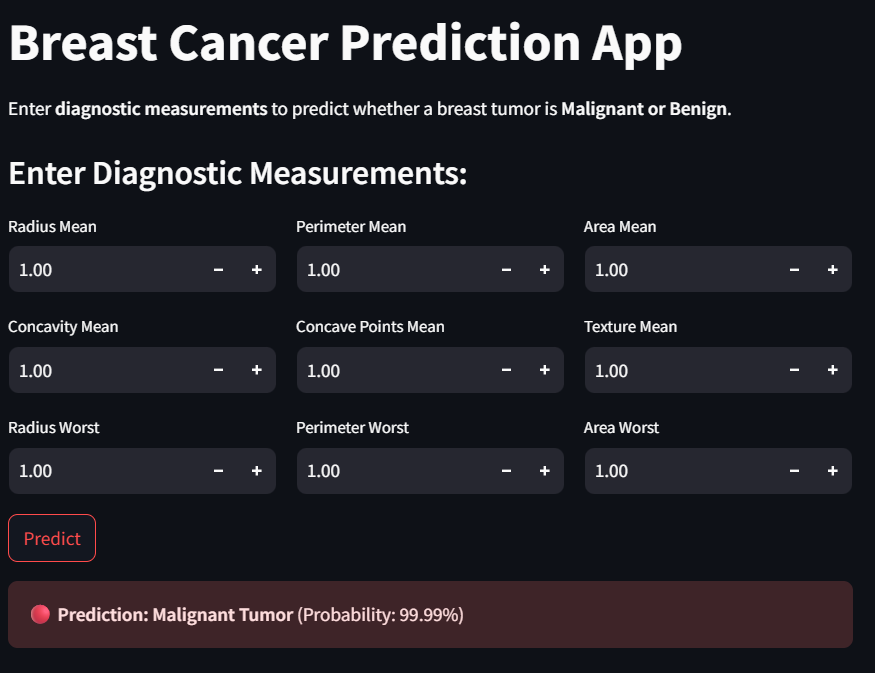

# 🩺 Breast Cancer Prediction App

A **Streamlit web application** to predict whether a breast tumor is **Malignant or Benign** using a **Logistic Regression model** trained on the Breast Cancer Wisconsin dataset.

---

## 🚀 Features

✅ Predicts **Malignant (Cancerous)** or **Benign (Non-Cancerous)** tumor status  
✅ **User-friendly interface** for entering diagnostic measurements  
✅ Displays **prediction with confidence probability**  
✅ Uses **Logistic Regression pipeline** with 30 diagnostic features  
✅ Deployable on **Streamlit Cloud** for your ML Portfolio

---

## 📊 How it works

- Users input **key diagnostic measurements** (e.g., radius, perimeter, area).
- The app auto-fills missing features required by the model.
- The trained pipeline predicts **Malignant or Benign**.
- Displays **clear visual feedback** for the user.

---

## 🛠️ Tech Stack

- **Python**
- **scikit-learn** (model training)
- **Streamlit** (deployment)
- **Pandas** (data handling)
